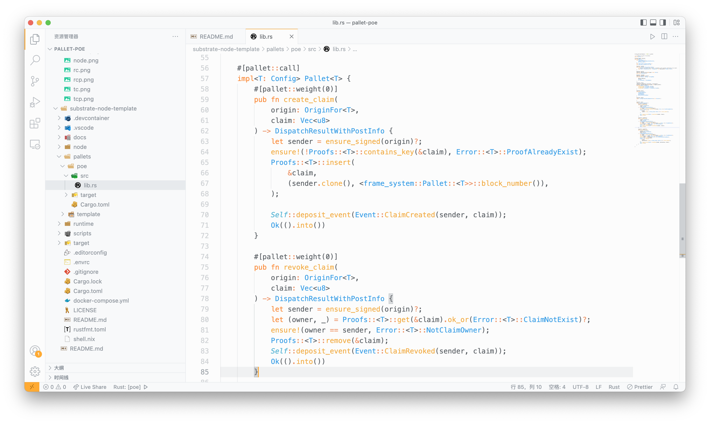
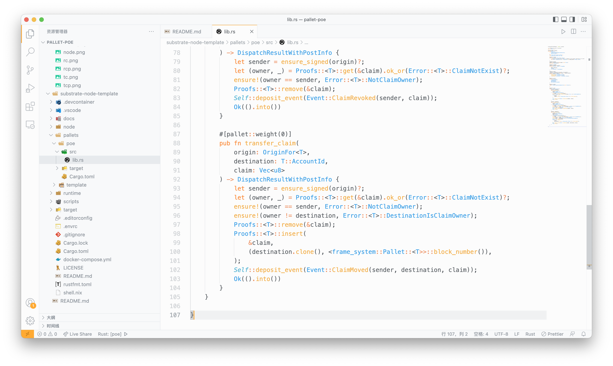
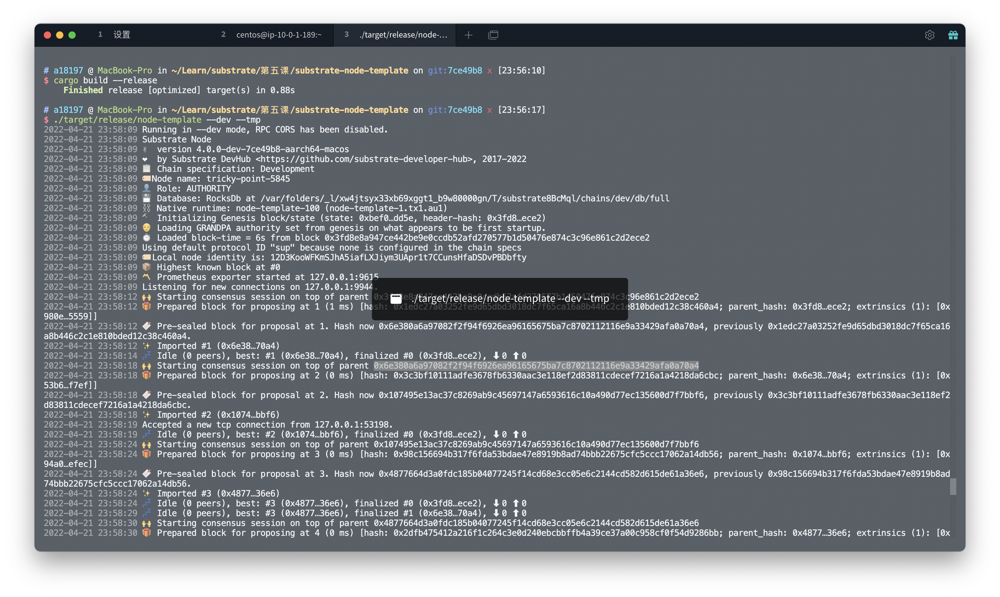
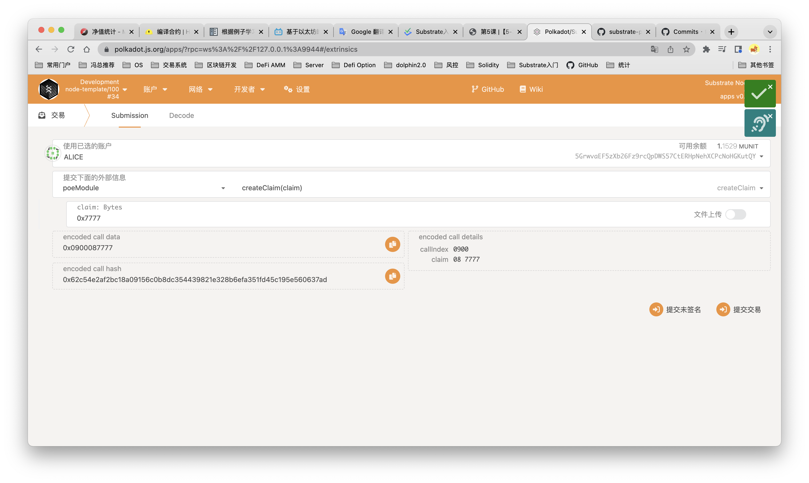
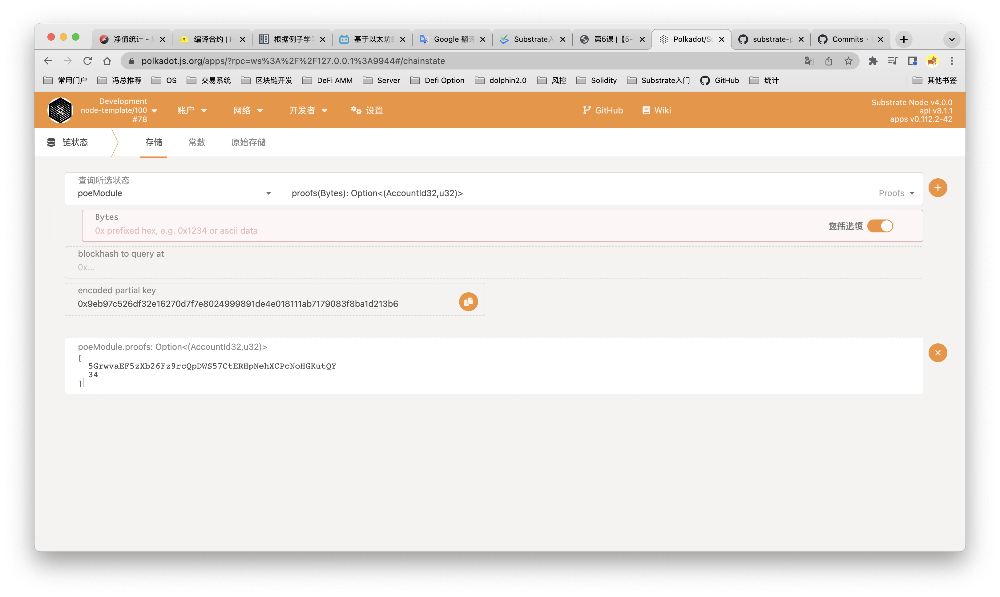
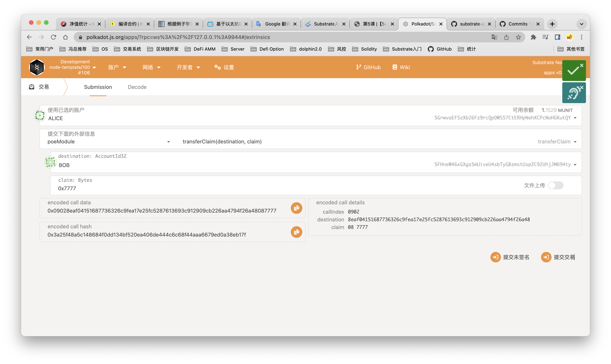
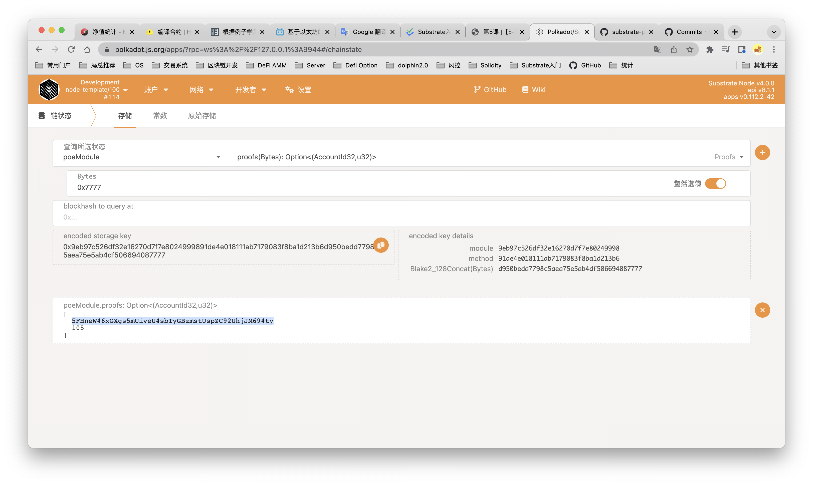
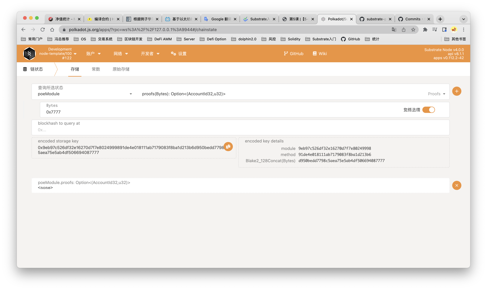
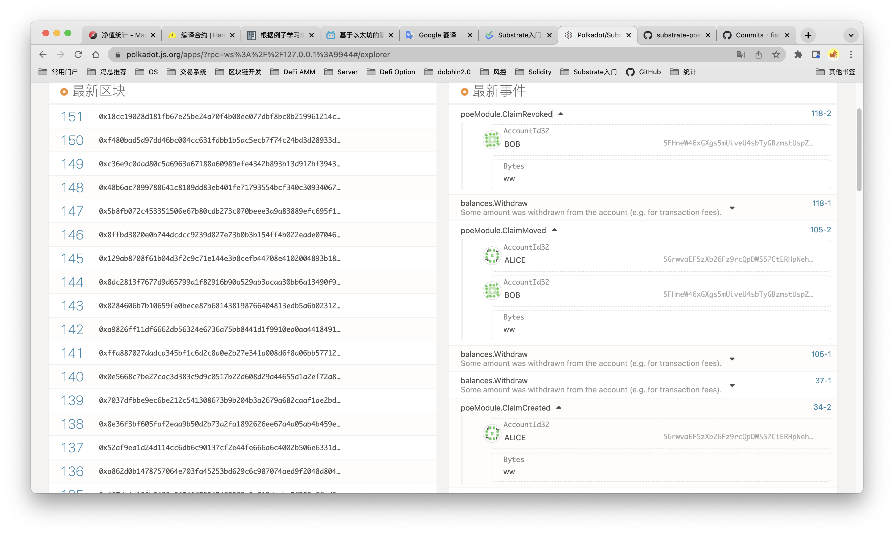

# pallet-poe

第五课作业：

1、实现存证模块的功能，包括：创建存证；撤销存证

2、为存证模块添加新的功能，转移存证，接收两个参数，一个是内容的哈希值，另一个是存证的接收账户地址

#### 创建、撤销存证代码片段

#### 转移存证代码片段

#### 区块链运行截图

#### 创建存证运行截图
交易：

查询claim，可以看到Alice地址上的存证:

#### 转移存证运行截图
交易：

查询claim，可以看到转移后Bob地址上的存证:

#### 撤销存证运行截图
交易：

查询claim，可以看到存证已不存在:

#### event查询截图
通过前端event查询，也可以佐证以上操作

